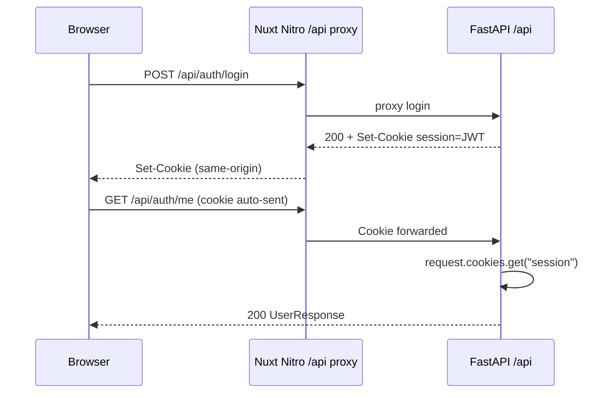

# Research: Refactor auth from session cookie to JWT Bearer access_token (no refresh)

**Date**: 2026-07-05T01:27:56+00:00
**Researcher**: Composer
**Git Commit**: [`29bb10b`](https://github.com/web-lizzard/adr-flow/commit/29bb10bad5669d725369537e721bd7327d5982fc)
**Branch**: main
**Repository**: [web-lizzard/adr-flow](https://github.com/web-lizzard/adr-flow)

## Research Question

Refactor authentication transport from httponly session cookie to JWT `access_token` in the `Authorization: Bearer` header (no refresh token).

## Summary

ADR Flow already mints HS256 JWTs on register/login via `JwtTokenService`; the gap is **transport only**. Today the token is written to an httponly `session` cookie and read from `request.cookies` in `get_current_user_id`. S-08 (roadmap) requires returning `access_token` in the login/register response body and accepting `Authorization: Bearer` on protected routes instead.

**Backend surface is small:** two production files change meaningfully (`auth.py`, `dependencies.py`), plus response schema and tests. `TokenService` / `JwtTokenService` stay unchanged. `COOKIE_SECURE` and `COOKIE_PATH` settings become removable.

**Frontend work is larger:** the auth store and all API calls must store and attach the token. There is no token persistence today (cookie-implicit). The hardest coupling is **save-on-unload** (`useAdrPersistence`): `navigator.sendBeacon` cannot set custom headers, so the current cookie-based beacon path breaks under Bearer auth and needs a redesign.

**Product semantics unchanged:** email/password registration and login, 24h JWT expiry, no refresh token, no explicit logout, per-user data isolation.

## Detailed Findings

### Current auth architecture

| Layer | Role today |
|-------|------------|
| `JwtTokenService` | HS256 JWT with `sub` (user UUID) and `exp` (24h default) |
| `auth.py` register/login | `create_token` → `_set_session_cookie` |
| `dependencies.py` `get_current_user_id` | Read `session` cookie → `decode_token` |
| 11 protected routes | `Depends(get_current_user_id)` (1 auth + 10 ADR) |
| Frontend auth store | `$fetch` without credentials/Authorization; relies on same-origin cookie |
| Nitro proxy | `proxyRequest` forwards cookies and headers transparently |

### Backend: cookie read/write sites

**Only production cookie read:**

- [`get_current_user_id`](https://github.com/web-lizzard/adr-flow/blob/29bb10bad5669d725369537e721bd7327d5982fc/backend/infrastructure/api/dependencies.py#L91-L105) — `request.cookies.get(SESSION_COOKIE_NAME)`; logs `auth.missing_cookie` on 401.

**Only production cookie writes:**

- [`register`](https://github.com/web-lizzard/adr-flow/blob/29bb10bad5669d725369537e721bd7327d5982fc/backend/infrastructure/api/routers/auth.py#L80-L81) and [`login`](https://github.com/web-lizzard/adr-flow/blob/29bb10bad5669d725369537e721bd7327d5982fc/backend/infrastructure/api/routers/auth.py#L112-L113) call `_set_session_cookie`.
- [`_set_session_cookie`](https://github.com/web-lizzard/adr-flow/blob/29bb10bad5669d725369537e721bd7327d5982fc/backend/infrastructure/api/routers/auth.py#L133-L146) — `httponly=True`, `secure=settings.cookie_secure`, `samesite="lax"`, `path=settings.cookie_path`, `max_age=86400`.

**No** `HTTPBearer`, `Authorization` header parsing, logout route, or `delete_cookie` anywhere in backend.

### Backend: protected route inventory

`get_current_user_id` is the sole auth gate, used at:

| Router | Endpoints |
|--------|-----------|
| `auth.py` | `GET /auth/me` |
| `adr.py` | create, list, search, get, patch, submit-review, retry-review, publish, review-status, beacon save (`POST /adrs/{id}/save`) |

Routers themselves need no signature changes — only the dependency implementation swaps cookie → Bearer.

### Backend: settings and CORS

| Setting | Env | Used by | After S-08 |
|---------|-----|---------|------------|
| `jwt_secret` | `JWT_SECRET` | `JwtTokenService` bootstrap | **Keep** |
| `cors_origins` | `CORS_ORIGINS` | CORS middleware | **Keep** (may be less critical with same-origin proxy) |
| `cookie_secure` | `COOKIE_SECURE` | `_set_session_cookie` only | **Remove** |
| `cookie_path` | `COOKIE_PATH` | `_set_session_cookie` only | **Remove** |

CORS today ([`bootstrap.py:186-192`](https://github.com/web-lizzard/adr-flow/blob/29bb10bad5669d725369537e721bd7327d5982fc/backend/infrastructure/bootstrap.py#L186-L192)):

- `allow_credentials=True` — required for cross-origin cookie auth; **optional after Bearer migration**
- `allow_headers=["*"]` — already permits `Authorization`

### Backend: TokenService stays unchanged

[`TokenService`](https://github.com/web-lizzard/adr-flow/blob/29bb10bad5669d725369537e721bd7327d5982fc/backend/application/ports/token_service.py) and [`JwtTokenService`](https://github.com/web-lizzard/adr-flow/blob/29bb10bad5669d725369537e721bd7327d5982fc/backend/infrastructure/adapters/auth/token_service.py) are transport-agnostic. Unit tests in [`test_jwt_token_service.py`](https://github.com/web-lizzard/adr-flow/blob/29bb10bad5669d725369537e721bd7327d5982fc/backend/tests/unit/auth/test_jwt_token_service.py) remain valid without modification.

### Backend: response schema change

[`UserResponse`](https://github.com/web-lizzard/adr-flow/blob/29bb10bad5669d725369537e721bd7327d5982fc/backend/infrastructure/api/schemas/auth.py#L27-L30) currently has `id`, `email`, `created_at` only. S-08 requires adding `access_token: str` on register/login responses (and possibly a dedicated auth response type if `/me` should not echo the token).

### Backend: test migration impact

| File | Cookie usage | Migration |
|------|--------------|-------------|
| [`test_auth.py`](https://github.com/web-lizzard/adr-flow/blob/29bb10bad5669d725369537e721bd7327d5982fc/backend/tests/infrastructure/api/test_auth.py) | Primary cookie contract (~30 tests including HttpOnly/SameSite/Max-Age/Secure) | Replace cookie helpers with `Authorization: Bearer`; delete cookie-flag tests; map JWT rejection tests to Bearer header |
| [`test_adr_api.py`](https://github.com/web-lizzard/adr-flow/blob/29bb10bad5669d725369537e721bd7327d5982fc/backend/tests/infrastructure/api/test_adr_api.py) | Implicit cookie jar after register; `auth_client.cookies.clear()` for multi-user | Header-based auth fixture; per-user token storage |
| [`conftest.py`](https://github.com/web-lizzard/adr-flow/blob/29bb10bad5669d725369537e721bd7327d5982fc/backend/tests/infrastructure/api/conftest.py) | `cookie_secure`, `cookie_path` in Settings | Remove cookie settings |
| [`test_task_group_bus.py`](https://github.com/web-lizzard/adr-flow/blob/29bb10bad5669d725369537e721bd7327d5982fc/backend/tests/infrastructure/messaging/test_task_group_bus.py) | Same cookie settings in fixture | Remove cookie settings |

### Frontend: current API auth pattern

**Auth store** ([`auth.ts`](https://github.com/web-lizzard/adr-flow/blob/29bb10bad5669d725369537e721bd7327d5982fc/frontend/app/stores/auth.ts)):

- `fetchUser`, `register`, `login` use plain `$fetch` — no `credentials`, no `Authorization`
- In-memory `user` ref only; **no** `localStorage` / `sessionStorage` anywhere in frontend

**ADR API layer** ([`useApi.ts`](https://github.com/web-lizzard/adr-flow/blob/29bb10bad5669d725369537e721bd7327d5982fc/frontend/composables/useApi.ts)):

- Nine protected `$fetch` helpers (all ADR endpoints except `fetchHealth`)
- No global `$fetch` interceptor or `onRequest` hook

**Auth bootstrap:**

- [`plugins/auth.ts`](https://github.com/web-lizzard/adr-flow/blob/29bb10bad5669d725369537e721bd7327d5982fc/frontend/app/plugins/auth.ts) — calls `fetchUser()` on app init (runs on SSR too)
- [`middleware/auth.ts`](https://github.com/web-lizzard/adr-flow/blob/29bb10bad5669d725369537e721bd7327d5982fc/frontend/app/middleware/auth.ts) — workspace guard via `fetchUser()`
- [`middleware/guest.ts`](https://github.com/web-lizzard/adr-flow/blob/29bb10bad5669d725369537e721bd7327d5982fc/frontend/app/middleware/guest.ts) — login/register redirect when authenticated

**Nitro proxy** ([`[...path].ts`](https://github.com/web-lizzard/adr-flow/blob/29bb10bad5669d725369537e721bd7327d5982fc/frontend/server/routes/api/%5B...path%5D.ts)):

- `proxyRequest` forwards incoming headers (including future `Authorization`) to `NUXT_API_UPSTREAM`
- No app-level cookie/header customization needed for Bearer

### Frontend: save-on-unload blocker (FR-006 coupling)

[`useAdrPersistence.ts`](https://github.com/web-lizzard/adr-flow/blob/29bb10bad5669d725369537e721bd7327d5982fc/frontend/app/composables/useAdrPersistence.ts#L25-L41) uses:

1. `navigator.sendBeacon(url, blob)` — **cannot set `Authorization` header**
2. Fallback `fetch` with `credentials: "include"` — cookie-based

This was an explicit S-02 design choice ([`draft-authoring-persistence` plan](https://github.com/web-lizzard/adr-flow/blob/29bb10bad5669d725369537e721bd7327d5982fc/context/archive/2026-06-16-draft-authoring-persistence/plan.md)): authenticate unload-save via httponly cookie on same-origin requests.

**Options for S-08 planning:**

| Option | Trade-off |
|--------|-----------|
| Use `fetch` + `keepalive` + `Authorization` only | Drops beacon fast-path; may lose save on hard kill in some browsers |
| Short-lived scoped cookie for beacon endpoint only | Hybrid transport; contradicts "no session cookie" goal unless narrowly scoped |
| Accept token in query param on beacon endpoint | Security risk if URLs logged; generally discouraged |
| Rely on save-on-blur + warn on unload only | Reduces unload-save reliability vs current behavior |

This is the highest-risk integration point for the transport migration.

### Frontend: recommended touchpoints

| Area | Files | Change |
|------|-------|--------|
| Token storage + attach | `auth.ts`, new `apiFetch` wrapper in `useApi.ts` | Store `access_token` from login/register; add `Authorization` on protected calls |
| ADR store | `adr.ts` | Consumes `useApi` — covered by central wrapper |
| Beacon save | `useAdrPersistence.ts` | Redesign auth for unload path |
| Tests | `auth.store.test.ts` | Assert `Authorization` header; update cookie wording |
| SSR | `plugins/auth.ts`, middleware | Token must be available on server requests or SSR auth hydration deferred to client |

### Deployment and security trade-offs

**Current production** (from [`deploy-gcp.md`](https://github.com/web-lizzard/adr-flow/blob/29bb10bad5669d725369537e721bd7327d5982fc/context/foundation/deploy-gcp.md)):

- Browser → same-origin `/api/*` via Nitro → `NUXT_API_UPSTREAM`
- FastAPI CORS with `allow_credentials=True` and explicit `CORS_ORIGINS`
- `COOKIE_SECURE=true`, `COOKIE_PATH=/api` in production

**After Bearer with same-origin proxy:**

- Primary browser path still bypasses FastAPI CORS
- `allow_credentials` less important
- `COOKIE_*` env vars removable from deploy scripts

**Security model shift:**

| | Cookie (S-01) | Bearer client-side (S-08) |
|--|---------------|---------------------------|
| XSS | httpOnly mitigates token theft | Token in JS-accessible storage is exfiltratable |
| CSRF | Cookie auto-sent; SameSite=lax | Bearer not auto-sent; lower CSRF surface |
| Mobile/API clients | Awkward (cookie jar) | Natural fit for `Authorization` header |

## Code References

### Backend

- [`backend/infrastructure/api/dependencies.py:23`](https://github.com/web-lizzard/adr-flow/blob/29bb10bad5669d725369537e721bd7327d5982fc/backend/infrastructure/api/dependencies.py#L23) — `SESSION_COOKIE_NAME = "session"`
- [`backend/infrastructure/api/dependencies.py:91-105`](https://github.com/web-lizzard/adr-flow/blob/29bb10bad5669d725369537e721bd7327d5982fc/backend/infrastructure/api/dependencies.py#L91-L105) — cookie-based `get_current_user_id` (swap target)
- [`backend/infrastructure/api/routers/auth.py:133-146`](https://github.com/web-lizzard/adr-flow/blob/29bb10bad5669d725369537e721bd7327d5982fc/backend/infrastructure/api/routers/auth.py#L133-L146) — `_set_session_cookie` (remove)
- [`backend/infrastructure/adapters/auth/token_service.py:11-41`](https://github.com/web-lizzard/adr-flow/blob/29bb10bad5669d725369537e721bd7327d5982fc/backend/infrastructure/adapters/auth/token_service.py#L11-L41) — JWT mint/verify (unchanged)
- [`backend/infrastructure/bootstrap.py:105`](https://github.com/web-lizzard/adr-flow/blob/29bb10bad5669d725369537e721bd7327d5982fc/backend/infrastructure/bootstrap.py#L105) — `JwtTokenService` wiring
- [`backend/infrastructure/bootstrap.py:186-192`](https://github.com/web-lizzard/adr-flow/blob/29bb10bad5669d725369537e721bd7327d5982fc/backend/infrastructure/bootstrap.py#L186-L192) — CORS middleware
- [`backend/infrastructure/config.py:24-29`](https://github.com/web-lizzard/adr-flow/blob/29bb10bad5669d725369537e721bd7327d5982fc/backend/infrastructure/config.py#L24-L29) — auth-related settings

### Frontend

- [`frontend/app/stores/auth.ts:29-66`](https://github.com/web-lizzard/adr-flow/blob/29bb10bad5669d725369537e721bd7327d5982fc/frontend/app/stores/auth.ts#L29-L66) — auth API calls (no token today)
- [`frontend/composables/useApi.ts:71-132`](https://github.com/web-lizzard/adr-flow/blob/29bb10bad5669d725369537e721bd7327d5982fc/frontend/composables/useApi.ts#L71-L132) — ADR API helpers (central attach point)
- [`frontend/app/composables/useAdrPersistence.ts:25-41`](https://github.com/web-lizzard/adr-flow/blob/29bb10bad5669d725369537e721bd7327d5982fc/frontend/app/composables/useAdrPersistence.ts#L25-L41) — beacon save (Bearer blocker)
- [`frontend/server/routes/api/[...path].ts:7-14`](https://github.com/web-lizzard/adr-flow/blob/29bb10bad5669d725369537e721bd7327d5982fc/frontend/server/routes/api/%5B...path%5D.ts#L7-L14) — Nitro proxy

### Config / deploy

- [`.env.example:19-22`](https://github.com/web-lizzard/adr-flow/blob/29bb10bad5669d725369537e721bd7327d5982fc/.env.example#L19-L22) — `JWT_SECRET`, `CORS_ORIGINS`, `COOKIE_*`

## Architecture Insights

1. **Transport-only migration** — Domain, application commands/queries, password hashing, and JWT semantics are already correct. The refactor is confined to HTTP ingress/egress and client token lifecycle.

2. **Single dependency swap** — All 11 protected endpoints funnel through `get_current_user_id`. Implementing Bearer parsing once updates the entire API surface.

3. **Cookie was a proxy convenience, not a JWT limitation** — S-01 chose cookies because Nitro same-origin proxying made auth transparent and enabled `sendBeacon` unload-save. S-08 trades that for explicit client token management.

4. **No refresh token by design** — 24h `exp` matches `SESSION_MAX_AGE_SECONDS=86400`. Users re-login after expiry; no silent refresh in MVP (roadmap Parked, PRD session note).

5. **Lessons.md** — No auth-specific lessons; domain error typing and aggregate API rules do not affect this change.

## Historical Context (from prior changes)

| Artifact | Insight |
|----------|---------|
| [`context/archive/2026-06-14-account-access/plan.md`](https://github.com/web-lizzard/adr-flow/blob/29bb10bad5669d725369537e721bd7327d5982fc/context/archive/2026-06-14-account-access/plan.md) | Original slice: JWT in httpOnly cookie, 24h session, no refresh/logout/RBAC |
| [`context/archive/2026-06-14-account-access/plan-brief.md`](https://github.com/web-lizzard/adr-flow/blob/29bb10bad5669d725369537e721bd7327d5982fc/context/archive/2026-06-14-account-access/plan-brief.md) | Nitro proxy + cookie = no client token management |
| [`context/archive/2026-06-16-draft-authoring-persistence/plan.md`](https://github.com/web-lizzard/adr-flow/blob/29bb10bad5669d725369537e721bd7327d5982fc/context/archive/2026-06-16-draft-authoring-persistence/plan.md) | `sendBeacon` unload-save authenticated via session cookie |
| [`context/archive/2026-06-15-testing-critical-path-domain-auth/research.md`](https://github.com/web-lizzard/adr-flow/blob/29bb10bad5669d725369537e721bd7327d5982fc/context/archive/2026-06-15-testing-critical-path-domain-auth/research.md) | Test suite built around cookie transport and CORS+credentials |
| [`context/foundation/roadmap.md` S-08](https://github.com/web-lizzard/adr-flow/blob/29bb10bad5669d725369537e721bd7327d5982fc/context/foundation/roadmap.md) | Outcome: Bearer header, token in body, no cookie, no refresh; parallel with S-06 |
| [`context/changes/remove-adr-from-active-list/research.md`](https://github.com/web-lizzard/adr-flow/blob/29bb10bad5669d725369537e721bd7327d5982fc/context/changes/remove-adr-from-active-list/research.md) | Notes S-08 may land in parallel; implement against transport at ship time |

## Related Research

- [`context/changes/remove-adr-from-active-list/research.md`](context/changes/remove-adr-from-active-list/research.md) — parallel slice; auth transport awareness
- [`context/archive/2026-06-15-testing-critical-path-domain-auth/research.md`](context/archive/2026-06-15-testing-critical-path-domain-auth/research.md) — cookie-based auth test patterns to migrate

## Open Questions

1. **Token storage location** — `sessionStorage` (tab-scoped, survives refresh) vs in-memory only (simpler SSR, lost on reload) vs `localStorage` (persists across tabs; higher XSS exposure window).

2. **SSR hydration** — Auth plugin runs on server; without cookie, server-side `fetchUser` needs token from request context or auth checks defer to client-only.

3. **Beacon save strategy** — How to preserve FR-006 unload-save under Bearer without reintroducing a session cookie (preferred approach for `/plan`).

4. **Response shape** — Extend `UserResponse` with `access_token` on all auth responses vs separate `AuthResponse` for login/register only.

5. **Logging rename** — `auth.missing_cookie` → `auth.missing_token` / `auth.invalid_token` (structured logging from struct archive).

6. **Deploy cleanup** — Remove `COOKIE_SECURE` / `COOKIE_PATH` from `deploy/gcp/run-api.flags`, `.env.example`, and devcontainer env.

7. **CORS simplification** — Whether to set `allow_credentials=False` explicitly after cookie removal.
