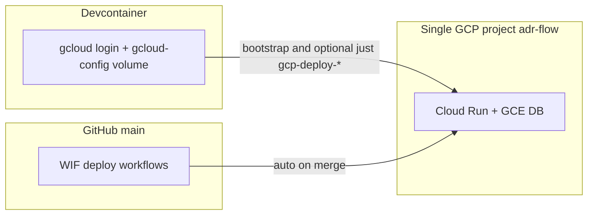

# GCP deployment runbook (ADR Flow)

Operator guide for the **MVP single-project** stack: Cloud Run API + web, GCE Postgres, Secret Manager, and GitHub Actions deploys on `main`. Bootstrap scripts and flag files: [`deploy/gcp/README.md`](../../deploy/gcp/README.md). Platform **why** (comparison, risks): [`infrastructure.md`](infrastructure.md).

**Region:** `europe-west1` (Belgium). Default project id: `adr-flow`.

---

## MVP deployment strategy (single GCP project)

One GCP project holds everything for solo after-hours MVP: GCE Postgres, Cloud Run `adr-flow-api` + `adr-flow-web`, secrets, backups. You do **not** need separate `adr-flow-dev` / `adr-flow-prod` projects yet.

| Who deploys | When | Target | Credentials |
|-------------|------|--------|-------------|
| **You in the devcontainer** | One-time bootstrap (`deploy/gcp/*.sh`), debugging, optional ad-hoc deploy | Same MVP project | `gcloud auth login` inside the container; config in Docker volume `gcloud-config` |
| **GitHub Actions** | Push/merge to `main` (path-filtered) | Same MVP project | Workload Identity Federation (WIF); no keys in the repo |

**Rules:**

- The **host machine** does not need `gcloud` or GCP credentials.
- The devcontainer is for the **MVP project only** — not a future production project.
- After CI is configured, **merge to `main`** is the normal release path; devcontainer deploy is optional.
- **Do not** deploy production from the devcontainer (see [Phase 2 — production](#phase-2--production-deferred) below).



**Target layout (MVP):**

- **API** (`adr-flow-api`): FastAPI, source deploy + uv buildpack, Direct VPC egress to GCE Postgres, secrets from Secret Manager.
- **Web** (`adr-flow-web`): Nuxt SSR image in Artifact Registry; Nitro proxies `/api/*` to the API URL (`NUXT_API_UPSTREAM`).
- **DB** (`adr-flow-db`): `e2-micro` VM, Postgres 15, daily `pg_dump` to `gs://adr-flow-backups-eu`.

---

## Prerequisites

Complete these before bootstrap or first deploy.

### Accounts and access

| Requirement | Why | Verify |
|-------------|-----|--------|
| Google account with billing | GCE VM (~$5–7/mo EU), Cloud Build, Artifact Registry | [Cloud Console → Billing](https://console.cloud.google.com/billing) linked to project |
| Permission to create/use a GCP project | Bootstrap creates/uses `adr-flow` (or env override) | `gcloud projects list` |
| Human operator IAM (bootstrap) | Run `deploy/gcp/*.sh` | `Owner` or bundle: `run.admin`, `compute.admin`, `secretmanager.admin`, `iam.serviceAccountAdmin`, `artifactregistry.admin`, `serviceusage.serviceUsageAdmin` |
| GitHub repo admin | WIF pool, Actions variables | Adjust repo in `05-wif-github.sh` if not `web-lizzard/adr-flow` |
| OpenRouter API key | AI review (Secret Manager at bootstrap) | [openrouter.ai](https://openrouter.ai/) — never commit |

### Local / devcontainer host

| Requirement | Why |
|-------------|-----|
| Dev Containers (Cursor / VS Code) | Repo is devcontainer-first |
| Docker on host | Compose + `gcloud-config` volume |
| Git + SSH to GitHub | Push triggers GHA deploy |

### Environment files

| File | Purpose |
|------|---------|
| Root `.env` (from [`.env.example`](../../.env.example)) | Optional `GCP_PROJECT_ID`, `GCP_REGION=europe-west1` for `just` and scripts |
| `deploy/gcp/secrets.env` (from `secrets.env.example`, gitignored) | Bootstrap-only: `GCP_BILLING_ACCOUNT`, `OPENROUTER_API_KEY`, optional `POSTGRES_PASSWORD` |

---

## First-time bootstrap

From the devcontainer, after [devcontainer authentication](#devcontainer-authentication):

```bash
cd deploy/gcp
cp secrets.env.example secrets.env   # edit before running

./01-project-apis.sh      # project + APIs
./02-network.sh           # Cloud Run subnet 10.8.0.0/24 + Postgres firewall
./03-gce-postgres.sh      # e2-micro VM, Postgres 15, backups bucket
./04-secrets.sh           # Secret Manager + API runtime SA
./05-wif-github.sh        # GitHub Actions WIF + deploy SA
./06-artifact-registry.sh # Docker repo for Nuxt image deploys
```

Then deploy services (API before web — web needs the API URL):

```bash
just gcp-deploy-api
just gcp-deploy-web
```

Configure GitHub (see [GitHub Actions on `main`](#github-actions-on-main)) using output from `05-wif-github.sh`.

Script tables and flag reference: [`deploy/gcp/README.md`](../../deploy/gcp/README.md).

---

## Devcontainer authentication

Manual bootstrap and ad-hoc deploys use credentials **inside the container**. The host does not need `gcloud` installed or logged in.

### Named volume (not a host bind mount)

[`.devcontainer/docker-compose.yml`](../../.devcontainer/docker-compose.yml) mounts Docker volume `gcloud-config` at `/home/vscode/.config/gcloud`. This survives devcontainer rebuilds and is **not** `${HOME}/.config/gcloud` from the host.

**Do not:** bind-mount host `~/.config/gcloud`; bake keys into the image; use devcontainer creds for a future prod project.

### Login flow

1. Ensure `gcloud` is installed (rebuild devcontainer, or run `bash .devcontainer/post-create.d/15-gcloud-cli.sh`).
2. Check status: `just gcp-auth`
3. Log in: `just gcp-auth-login` (same as `gcloud auth login --no-launch-browser` — open the URL in any browser).
4. After `01-project-apis.sh`:
   ```bash
   gcloud config set project adr-flow    # or your GCP_PROJECT_ID
   gcloud config set run/region europe-west1
   ```

**CI is independent:** GitHub Actions uses WIF only, not the devcontainer volume.

### MCP servers (gcloud, observability, GitHub)

Cursor MCP servers for troubleshooting run **inside** the devcontainer and reuse the same `gcloud-config` volume. They do not use WIF or `deploy/gcp/secrets.env`. Server definitions live in `.cursor/mcp.json`; GitHub token and flags in root `.env` (see `.env.example`).

1. Set `GITHUB_PERSONAL_ACCESS_TOKEN` in `.env` (read-only fine-grained PAT).
2. Complete the login flow above (`just gcp-auth`, project/region).
3. Rebuild the devcontainer, then `just mcp-verify` and the checklist in [`.devcontainer/MCP.md`](../../.devcontainer/MCP.md).

### Optional: Cloud Code extension

[`devcontainer.json`](../../.devcontainer/devcontainer.json) can include `GoogleCloudTools.cloudcode` for Cloud Run explorer, logs, and ad-hoc deploy UI. For production-parity flags (`--no-cpu-throttling`, VPC egress), prefer **`just gcp-deploy-api`** / **`just gcp-deploy-web`** over Cloud Code defaults.

### Auth troubleshooting

| Symptom | Step |
|---------|------|
| `gcloud` not found | Rebuild devcontainer or run `15-gcloud-cli.sh` |
| `Reauthentication required` | `just gcp-auth-login` again (volume keeps config path) |
| Credentials lost after rebuild | Check `docker volume ls` for `gcloud-config`; re-login if volume was removed |
| Cloud Code “no project” | `gcloud config set project …`; reload window |
| Deploy works locally but CI fails | CI uses WIF — check Actions variables, not devcontainer creds |
| Browser auth in remote/Codespaces | Use `--no-launch-browser`; paste URL from any device |

---

## GitHub Actions on `main`

After `05-wif-github.sh`, set **Settings → Secrets and variables → Actions → Variables**:

| Variable | Example |
|----------|---------|
| `GCP_PROJECT_ID` | `adr-flow` |
| `GCP_REGION` | `europe-west1` |
| `WIF_PROVIDER` | Full provider resource name from bootstrap output |
| `WIF_SERVICE_ACCOUNT` | `adr-flow-github-deploy@….iam.gserviceaccount.com` |

Workflows run on **push to `main`** with path filters. Both need `permissions: id-token: write` for OIDC.

| Workflow | Paths | What it does |
|----------|-------|----------------|
| [`.github/workflows/deploy-gcp.yml`](../../.github/workflows/deploy-gcp.yml) | Path-filtered `backend/**` / `frontend/**` (+ related `deploy/gcp/*` and workflow file) | WIF auth → API job (`deploy-api.sh`) then web job (Docker build/push, `NUXT_API_UPSTREAM` from live `adr-flow-api`) |

**Release habit:** merge to `main`; only changed paths run. When both API and web paths change, **API deploys first**, then web (`deploy-web` `needs: deploy-api`). Frontend-only pushes skip API and deploy web if `adr-flow-api` already exists. Greenfield: run API once before first web deploy.

**Deploy SA roles (bootstrap):** `run.admin`, `artifactregistry.writer`, `cloudbuild.builds.editor`, `iam.serviceAccountUser` — not project Owner.

### CI troubleshooting

| Issue | Step |
|-------|------|
| WIF `attribute.repository` mismatch (fork PR) | Fork PRs fail auth by design; use manual deploy or accept `pull_request_target` security trade-off |
| OIDC not enabled | Ensure workflow has `id-token: write` |
| First deploy prompts for AR repo | Run `06-artifact-registry.sh` once |
| Org policy blocks public Run | Remove `--allow-unauthenticated`; add IAM invoker / IAP later |
| Billing disabled | Enable billing before `01-project-apis.sh` |

---

## Optional manual deploy (devcontainer)

Use when debugging or before CI exists. Same flags/env as GHA via shared files:

| Recipe | Action |
|--------|--------|
| `just gcp-auth` | Active account, project, region; login hint |
| `just gcp-auth-login` | Interactive login |
| `just gcp-deploy-api` | `deploy/gcp/deploy-api.sh` → `run-api.flags` |
| `just gcp-deploy-web` | `deploy/gcp/deploy-web.sh` → Cloud Build + `run-web.flags` + `NUXT_API_UPSTREAM` |

Smoke checks:

```bash
API_URL="$(gcloud run services describe adr-flow-api --region=europe-west1 --format='value(status.url)')"
curl "${API_URL}/health"

WEB_URL="$(gcloud run services describe adr-flow-web --region=europe-west1 --format='value(status.url)')"
curl "${WEB_URL}/api/health"
```

Browser: open the web URL; home page should show API health via same-origin `/api/health` (no CORS).

---

## Verification checklist

1. `curl https://<api-url>/health` → `{"status":"ok"}`
2. Nuxt home loads from web service URL
3. `curl https://<web-url>/api/health` → `{"status":"ok"}`
4. Browser DevTools: no CORS errors; Network shows `/api/health` on web origin
5. (When DB code exists) API execution logs show Postgres connectivity
6. `gcloud run services logs read adr-flow-api --region=europe-west1`
7. Secret rotation: new Secret Manager version + redeploy API
8. Backup drill: `gsutil ls gs://adr-flow-backups-eu/`
9. Rollback: traffic to previous revision (see below)

---

## Operations

### Rollback

```bash
# List revisions
gcloud run revisions list --service=adr-flow-api --region=europe-west1

# Send 100% traffic to a previous revision
gcloud run services update-traffic adr-flow-api \
  --region=europe-west1 \
  --to-revisions=REVISION_NAME=100
```

Repeat for `adr-flow-web` if needed.

### Backups

- Bucket: `gs://adr-flow-backups-eu`
- VM cron: daily `pg_dump -Fc` at 03:00 UTC
- Weekly check: `gsutil ls gs://adr-flow-backups-eu/`
- Quarterly: test restore from a dump

### Secrets

| Secret | Used by | Notes |
|--------|---------|-------|
| `db-url` | API (`DATABASE_URL`) | GCE **internal** IP in connection string |
| `openrouter-key` | API (`OPENROUTER_API_KEY`) | When AI review is implemented |

Rotate: add new version in Secret Manager → redeploy API so Cloud Run picks up `:latest` or pin a version in deploy flags.

### External dependencies

- **OpenRouter:** rate limits and timeouts are an external dependency; monitor API logs when AI review ships.
- **Frontend → API:** browser uses `/api/*` on the web origin; Nitro proxies to `NUXT_API_UPSTREAM`. No FastAPI CORS required for MVP health. Add CORS only if the browser calls the API host directly later.

---

## Troubleshooting

| Risk | Detection | Mitigation |
|------|-----------|------------|
| Container failed to start (PORT) | Deploy fails, “failed to listen” | API: buildpack → 8080; Web: `PORT=8080`, `HOST=0.0.0.0` in Dockerfile |
| uv buildpack ignores lock | Nondeterministic deps | Keep `uv.lock`; set `GOOGLE_PYTHON_PACKAGE_MANAGER=uv` |
| Postgres connection exhaustion | API 500, `too many connections` | Pool `max_size` ≤ 5; tune VM `max_connections`; consider e2-small |
| Duplicate event processing | Double AI reviews | `--max-instances=1`; idempotent handlers when event code lands |
| Cold start + scale to zero | Long jobs interrupted | `--no-cpu-throttling` helps but instance can still scale down after idle; temporary `--min-instances=1` or startup replay from Postgres |
| Proxy 502 / empty `/api/health` | Nitro cannot reach API | Check `NUXT_API_UPSTREAM`, API deployed and reachable |
| `NUXT_API_UPSTREAM` unset | `/api/health` fails on web | Set on web service at deploy (script/workflow does this) |
| CORS / wrong API URL | Browser blocked | Use `/api/*` proxy; avoid `fetch` to `*.run.app` API host from browser |
| Artifact Registry bloat | Rising storage bill | Cleanup policy; `gcloud artifacts docker images list` |
| `pg_dump` cron silent fail | Empty bucket | Check VM cron logs; weekly `gsutil ls` |
| EU cost surprise | Bill alert | Budget ~$10; e2-micro ~$5–7/mo |

---

## Phase 2 — production (deferred)

When real users or stricter ops matter, split environments **without rewriting application code**. Implementation is a separate PR; this section is the outline only.

### GCP and data

| Piece | Change |
|-------|--------|
| **GCP** | New project e.g. `adr-flow-prod`; keep `adr-flow` as dev/staging or retire it |
| **WIF** | Same pool; attribute conditions or separate deploy SA per project; `GCP_PROJECT_ID` from GitHub Environment secrets |
| **Database** | `pg_dump` / migrate to prod (Cloud SQL or prod GCE); never point preview deploys at prod DB |
| **Devcontainer** | Still dev/staging project only — **do not** document or run prod deploy from the container |

### GitHub: manual production pipeline (outline)

Add [`.github/workflows/deploy-prod.yml`](../../.github/workflows/deploy-prod.yml) (not in repo yet) with roughly:

```yaml
# Outline only — not wired in MVP
name: Deploy production

on:
  workflow_dispatch:
    inputs:
      ref:
        description: Git ref to deploy (default main)
        required: false
        default: main

jobs:
  deploy-api:
    environment: production   # required reviewers, protection rules
  deploy-web:
    environment: production
    needs: deploy-api
```

**Behavior:**

- Trigger: **`workflow_dispatch` only** (manual “Deploy prod” in Actions UI), and/or tags `v*` if you add `on: push: tags`.
- **`environment: production`** on jobs: required reviewers, deployment branches, secrets scoped to prod (`GCP_PROJECT_ID` = `adr-flow-prod`, prod `WIF_SERVICE_ACCOUNT` if separate).
- **Steps:** mirror MVP workflow — `google-github-actions/auth@v3` with prod WIF vars → `deploy-api.sh` then web build+deploy as in [`deploy-gcp.yml`](../../.github/workflows/deploy-gcp.yml).
- **No devcontainer involvement** for prod releases.

### Optional later (out of MVP scope)

- PR preview: `gcloud run deploy --tag pr-N --no-traffic` on `pull_request`; separate DB or migrations strategy required.
- Custom domain + DNS
- Cloud SQL migration, Redis / Memorystore
- Terraform replacing shell bootstrap

---

## References

- [`deploy/gcp/README.md`](../../deploy/gcp/README.md) — bootstrap scripts, flags files, deploy commands
- [`infrastructure.md`](infrastructure.md) — platform decision, risk register
- [Cloud Run CPU allocation](https://cloud.google.com/run/docs/configuring/cpu-allocation)
- [Direct VPC egress](https://cloud.google.com/run/docs/configuring/vpc-direct-vpc)
- [Python dependencies on Cloud Run](https://cloud.google.com/run/docs/runtimes/python-dependencies)
- [google-github-actions/auth](https://github.com/google-github-actions/auth)
